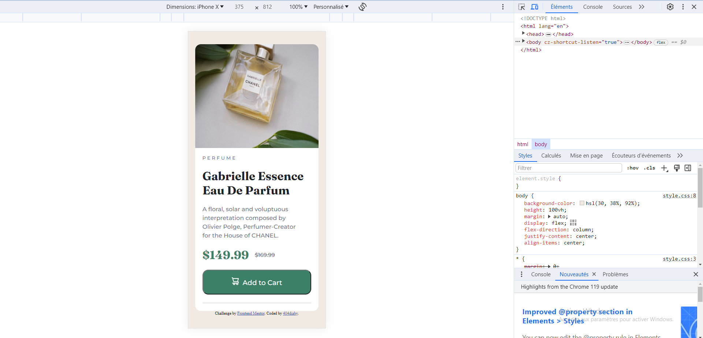

# Frontend Mentor - Product preview card component solution

This is a solution to the [Product preview card component challenge on Frontend Mentor](https://www.frontendmentor.io/challenges/product-preview-card-component-GO7UmttRfa). Frontend Mentor challenges help you improve your coding skills by building realistic projects. 

## Table of contents

- [Overview](#overview)
  - [The challenge](#the-challenge)
  - [Screenshot](#screenshot)
  - [Links](#links)
- [My process](#my-process)
  - [Built with](#built-with)
  - [What I learned](#what-i-learned)
  - [Continued development](#continued-development)
  - [Useful resources](#useful-resources)
- [Author](#author)
- [Acknowledgments](#acknowledgments)

**Note: Delete this note and update the table of contents based on what sections you keep.**

## Overview

### The challenge

Users should be able to:

- View the optimal layout depending on their device's screen size
- See hover and focus states for interactive elements

### Screenshot

### Links

- Solution URL: [solution URL here](https://https://github.com/404diaby/product-view-card-component)
- Live Site URL: [live site URL here](https://product-view-card-component-pink.vercel.app/)

## My process
- Read entire documentation for project
- Divide each component inside project into small tasks to be completed
- Work on one thing at a time
- Then worked on component shape to fit with frontendmentor design
- Followed style guides inside project for fonts and page color

### Built with

- Semantic HTML5 markup
- CSS custom properties
- Flexbox
- Mobile-first workflow

### What I learned

### Continued development

### Useful resources

## Author

- Website - [Diaby Mamadou](https://diaby-mamadou.vercel.app/)
- Frontend Mentor - [@404diaby](https://www.frontendmentor.io/profile/404diaby)
- Twitter - [@404diaby](https://twitter.com/404diaby)
- Github - [@404diaby](https://github.com/404diaby)

## Acknowledgments
